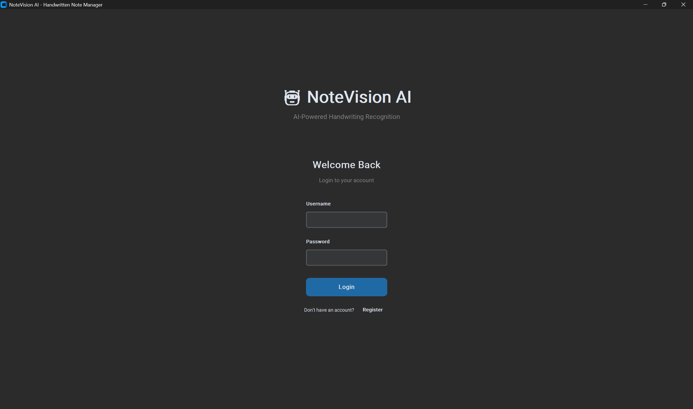
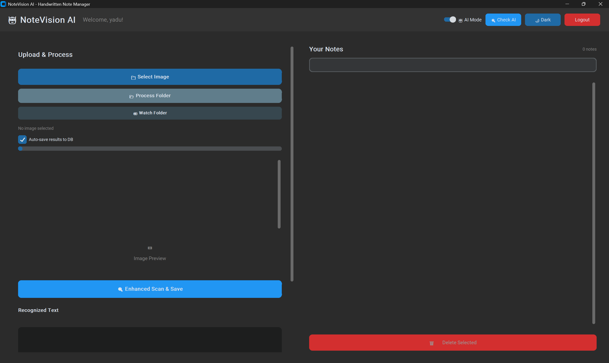
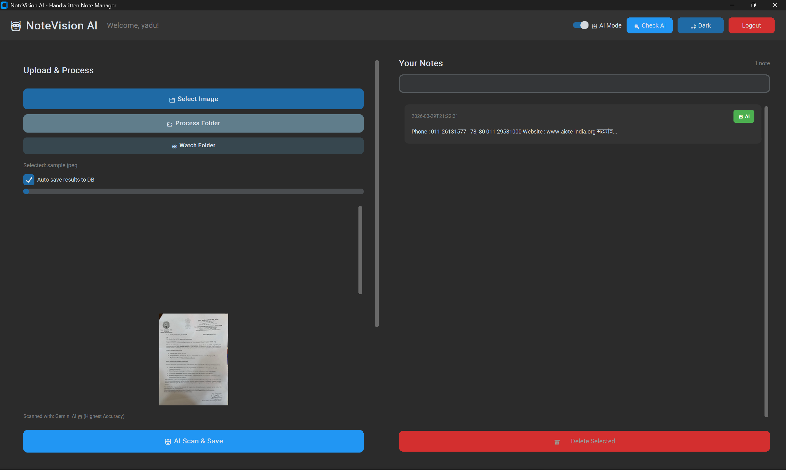
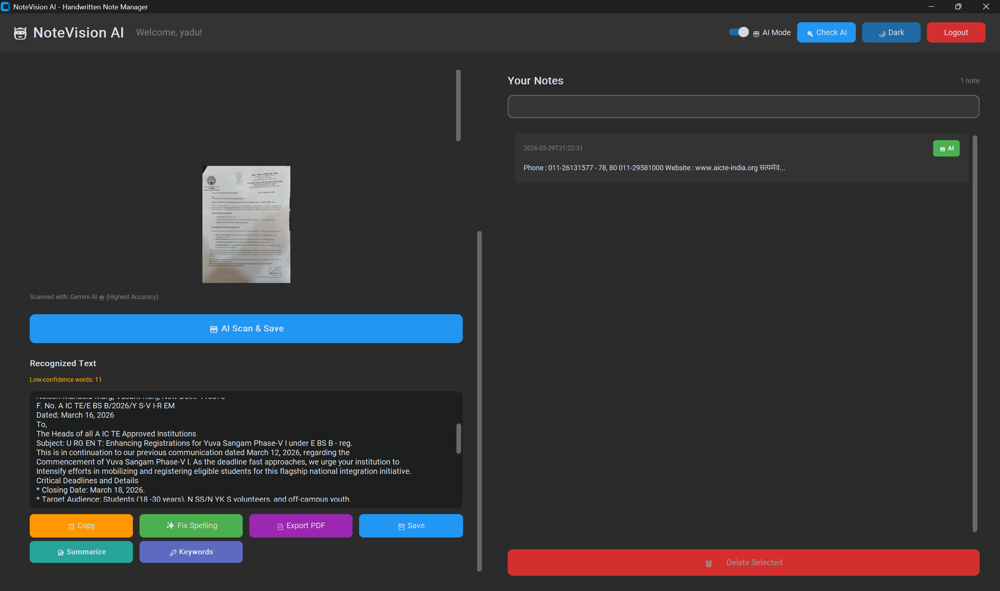

# OCR Text Conversion System

An OCR-based system designed to convert handwritten and printed text into digital format using Tesseract OCR and image preprocessing techniques.

## Overview
This project processes input images, enhances them using preprocessing techniques, and extracts text using the Tesseract OCR engine. It aims to improve accuracy for both handwritten and printed text.

## Features
- Handwritten and printed text recognition
- Image preprocessing for better OCR accuracy
- Automated text extraction pipeline
- Structured digital text output

## Tech Stack
- Python
- Tesseract OCR
- OpenCV (if used)

## How It Works
1. Input image is provided
2. Image is preprocessed (noise removal, thresholding)
3. OCR engine extracts text
4. Output is generated in readable format

## Use Cases
- Digitizing handwritten notes
- Extracting text from documents/images
- Academic and document processing

## Future Improvements
- Improve accuracy for complex handwriting
- Add GUI interface
- Support for multiple languages

## Demo

### Login Page

### Dashboard Image

### Input Image

### Output Result

